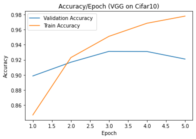
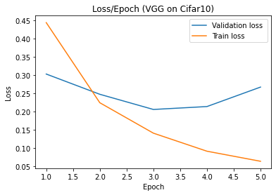
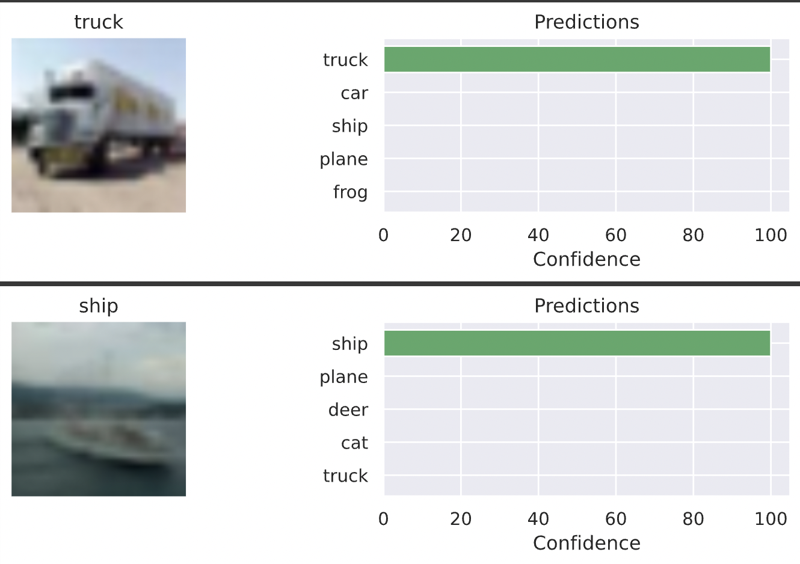
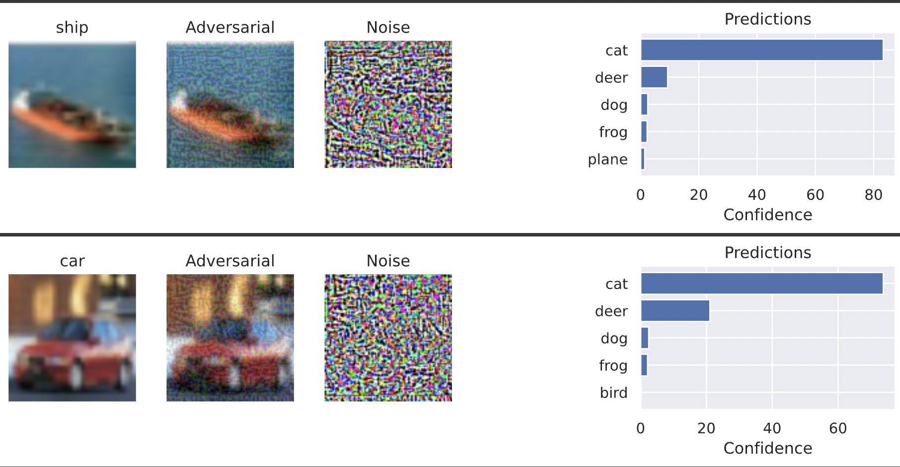
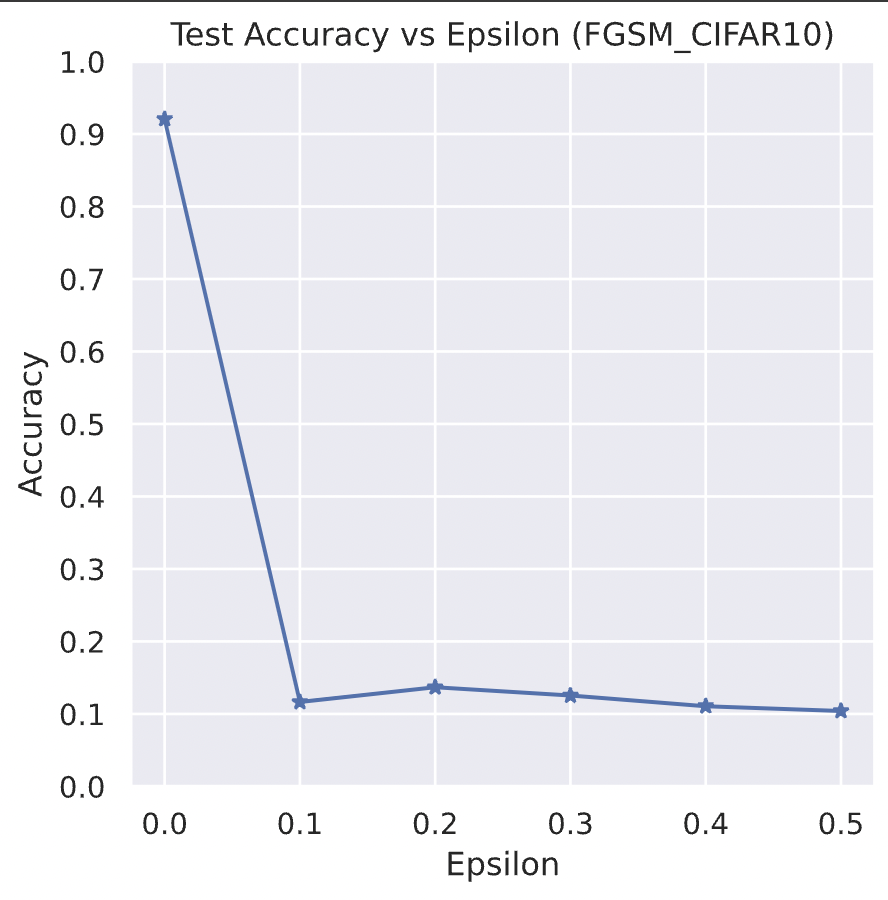

# Adversarial Attack (Fast Gradient Sign Method) on CIFAR-10 dataset 

<h2> Training result </h2>

<h3> An example of a model prediction </h3>

<h3> An example of model prediction after the adversarial attack </h3>

<h3> Model accuracy results on test data with increasing attack impact </h3>

